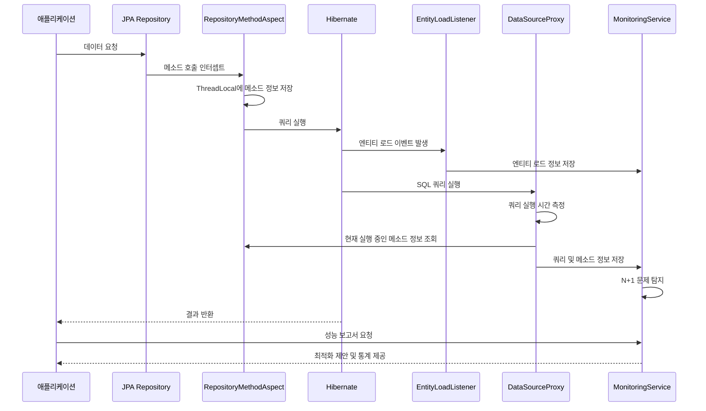

## Jpa-Performance-Tracker

JPA 애플리케이션의 성능을 모니터링하고 최적화 방안을 제시하는 라이브러리입니다.

### 핵심 컴포넌트

### 1. RepositoryMethodAspect
    - AOP를 통해 JpaRepository 의 메소드 가로챔
    - ThreadLocal 에 JpaRepository를 구현한 클래스 이름, 호출한 메소드 정보 저장

### 2. EntityLoadListener
    - 엔티티 로드 이벤트 발생 시 엔티티 클래스 이름 및 식별자 정보 저장
    - 컬렉션 초기화 이벤트 발생 시 OwnerEntityName 저장 -> Role 저장 (자식 엔티티들 이름 및 식별자) => 연관 관계 정보 수집
    - 위 정보를 바탕으로 연관 관계 최적화 제안 및 N + 1 문제 가능성 제안 ~> 투표 수 매커니즘 고려

### 3. PerformanceDataSourceProxy
    - Connection 생성 및 ConnectionInvocationHandler 로 프록시 처리

### 4. ConnectionInvocationHandler
    - PrepareStatement 생성 및 StatementInvocationHandler 로 프록시 처리

### 5. StatementInvocationHandler
    - 쿼리 실행 시간 계산
    - MonitoringService 에 쿼리 실행 정보와 쿼리를 호출한 클래스, 메소드 정보 전달

### 6. MonitoringService
    - N + 1 발생 여부 검증
    - 연관 관계 최적화 제안
    - 쿼리 실행 시간 제공
    - 레포지토리 메소드 별 쿼리 통계 생성

### 7. ReportService
    - 메일을 통해 모니터링을 통해 수집한 정보 전송

### 시퀀서 다이어그램

